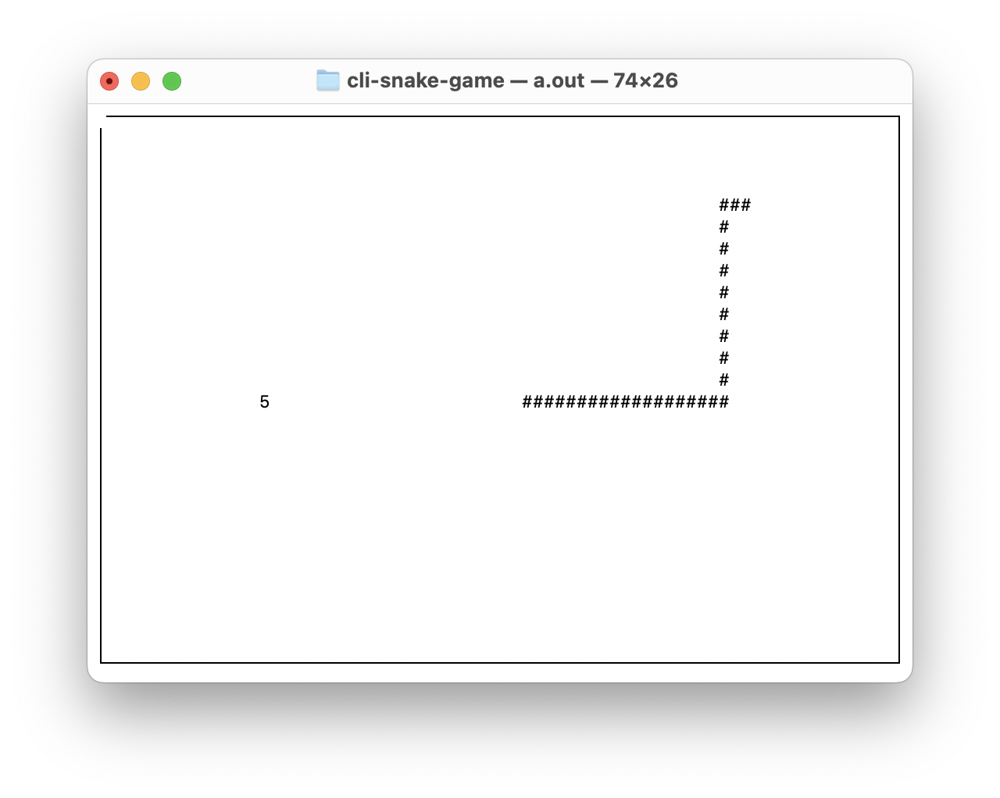

# CLI Snake Game

---

This is a collaborative effort to build an open source snake game 
for UNIX in C, using curses.h



---

## Getting Started

### **Building the program**
If you're planning on running this project within an IDE, generate a
cmake project, and all dependencies will be resolved via the top-level
CMakeLists.txt file.

IDE execution is not your thing? You can manually compile and run the program
through any CLI (provided your environment is set up properly) using the following commands:

1) ```gcc game.c -lcurses```

2) ```./a.out```

### **Version control**

1. **Clone the repository:**
```shell
  git clone https://github.com/gjinrexhaj/java-neural-network.git
```
2. **Create a feature branch before working on a new task:**
```shell
  git checkout -b feature/<your-feature-name>
```
3. **Commit changes regularly:**
```shell
   git add <changed-files>
   git commit -m "Message")>
```
4. **Push your branch and create a pull request:**
```shell
   git push origin feature/<your-feature-name>
```

## Contributors
<a href="https://github.com/gjinrexhaj"></a>
<a href="https://github.com/tylerk4brown"></a>